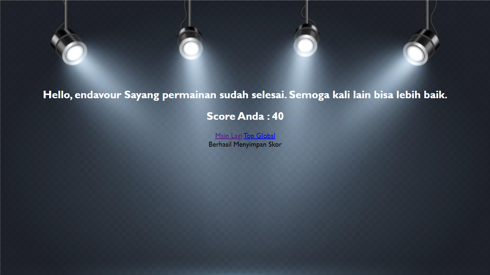

# UTS PEMROGRAMAN WEB
## Firdaus Ditio Ramadhan - K3519034 

Pada website ini, diberikan sebuah game matematika penjumlahan. Pada tampilan awal, akan terdapat login form yang berguna untuk menyimpan data username dari player. Setelah berhasil login, maka akan langsung diberikan soal penjumlahan dengan dua angka random dari 0 sampai 20. Untuk pertama kali, akan diberikan lives sebanyak 5 dan skor awal 0. Jika jawaban benar maka skor bertambah 10. Jika jawaban salah maka skor akan berkurang 2 dan lives berkurang 1. Jika lives mencapai 0, maka game akan selesai dan muncul pesan dan skor terakhir yang didapatkan.

 

# **Tampilan Awal Website**

# **Tampilan Awal Game**

# **Tampilan Ketika Menjawab Dengan Benar**

# **Tampilan Ketika Menjawab Dengan Salah**

# **Tampilan Ketika Nyawa Sudah Mencapai 0**

# **Tampilan Leaderboard top 10**

 

## Link Website : http://endeavour.infinityfreeapp.com/
